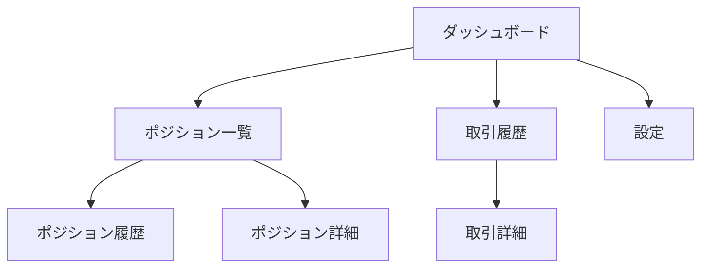

# 画面設計

## 概要

管理画面の画面一覧と各画面の表示項目・操作を定義する。

---

## 画面一覧

| 画面名 | パス | 説明 |
|--------|------|------|
| ダッシュボード | `/` | システム全体の状態を一覧表示 |
| ポジション一覧 | `/positions` | 保有中ポジションの一覧 |
| ポジション履歴 | `/positions/history` | クローズ済みポジションの一覧 |
| 取引履歴 | `/trades` | 確定損益の一覧・グラフ |
| 設定 | `/settings` | 取引設定の表示・編集 |

---

## 画面遷移図



---

## 1. ダッシュボード（`/`）

システム全体の状態を一目で把握するための画面。

### 表示項目

| 項目 | 説明 | データソース |
|------|------|-------------|
| 累積確定損益 | 全期間の確定損益合計 | `trades` |
| 本日の確定損益 | 当日の確定損益合計 | `trades` |
| 保有ポジション数 | 現在のOPENポジション数（x/10） | `positions` |
| 新規買い状態 | 有効 / 停止中 | `trading_settings.is_buy_enabled` |
| 停止ライン | -1000円（設定値） | `trading_settings.stop_loss_threshold` |
| APIキー期限 | 残り日数、期限日 | `secret_metadata.expires_at` |

### ステータス表示

```
┌─────────────────────────────────────────────────┐
│ ダッシュボード                                    │
├─────────────────────────────────────────────────┤
│                                                 │
│  累積損益        本日損益        保有数          │
│  ┌─────────┐   ┌─────────┐   ┌─────────┐      │
│  │ +2,500円│   │  +500円 │   │  3/10   │      │
│  └─────────┘   └─────────┘   └─────────┘      │
│                                                 │
│  ステータス                                      │
│  ┌─────────────────────────────────────────┐   │
│  │ 新規買い: 有効                            │   │
│  │ 停止ライン: -1,000円                      │   │
│  │ APIキー期限: 残り14日（2025/02/01）        │   │
│  └─────────────────────────────────────────┘   │
│                                                 │
└─────────────────────────────────────────────────┘
```

### 操作

- なし（表示のみ）
- 各セクションから詳細画面へ遷移可能

---

## 2. ポジション一覧（`/positions`）

保有中のポジションを一覧表示する画面。

### 表示項目（テーブル）

| カラム | 説明 |
|--------|------|
| 銘柄 | シンボル名（ティッカー） |
| 取得価格 | エントリー価格 |
| 現在価格 | 最新価格（リアルタイム or 定期更新） |
| 数量 | 保有数量 |
| 評価損益 | (現在価格 - 取得価格) × 数量 |
| TP価格 | 利確価格（+10%） |
| SL価格 | 損切り価格（-5%） |
| 取得日時 | ポジションオープン日時 |

### 操作

- **履歴を見る**: ポジション履歴画面へ遷移
- **詳細を見る**: ポジション詳細（モーダル or 別画面）

---

## 3. ポジション履歴（`/positions/history`）

クローズ済みポジションの一覧を表示する画面。

### 表示項目（テーブル）

| カラム | 説明 |
|--------|------|
| 銘柄 | シンボル名 |
| 取得価格 | エントリー価格 |
| 決済価格 | 決済時の価格 |
| 数量 | 取引数量 |
| 確定損益 | 決済損益 |
| 決済理由 | TP（利確） / SL（損切り） |
| 取得日時 | オープン日時 |
| 決済日時 | クローズ日時 |

### フィルター

- 期間（今日、今週、今月、全期間）
- 決済理由（TP / SL / 全て）

### 操作

- **詳細を見る**: ポジション詳細

---

## 4. 取引履歴（`/trades`）

確定損益の一覧とグラフを表示する画面。

### 表示項目

#### サマリー

| 項目 | 説明 |
|------|------|
| 累積確定損益 | 全期間の合計 |
| 勝率 | TP回数 / 総決済回数 |
| 平均利益 | TP時の平均損益 |
| 平均損失 | SL時の平均損益 |

#### 損益推移グラフ

- X軸: 日付
- Y軸: 累積損益
- データソース: `daily_pnl`

#### 取引一覧（テーブル）

| カラム | 説明 |
|--------|------|
| 日時 | 取引日時 |
| 銘柄 | シンボル名 |
| 種別 | ENTRY / EXIT |
| 価格 | 約定価格 |
| 数量 | 取引数量 |
| 損益 | 確定損益（EXITのみ） |

### フィルター

- 期間（今日、今週、今月、全期間）

### 操作

- なし（表示のみ）

---

## 5. 設定（`/settings`）

取引設定の表示・編集を行う画面。

### 表示・編集項目

| 項目 | 型 | 説明 | デフォルト |
|------|---|------|-----------|
| 新規買い有効 | Boolean | 買い注文を発行するか | true |
| 最大ポジション数 | Integer | 同時保有の上限 | 10 |
| 1ポジション投入額 | Integer | 1回の買い金額（円） | 1000 |
| 利確パーセンテージ | Decimal | TP価格の上昇率 | 0.10（10%） |
| 損切りパーセンテージ | Decimal | SL価格の下落率 | 0.05（5%） |
| 停止ライン | Integer | 累積損益の停止閾値（円） | -1000 |

### APIキー管理

| 項目 | 説明 |
|------|------|
| キー名 | WEBULL_APP_SECRET |
| 有効期限 | 期限日時 |
| 最終更新日 | 最後にキーを更新した日時 |
| 残り日数 | 期限までの日数 |

### 操作

- **設定を保存**: 変更を保存
- **キー更新開始**: キー更新フローを開始（外部リンク or モーダル）
- **買い停止解除**: is_buy_enabled を true に変更

---

## 共通コンポーネント

### ヘッダー

```
┌─────────────────────────────────────────────────┐
│ [Logo] 自動売買システム                          │
│                                                 │
│ [ダッシュボード] [ポジション] [取引履歴] [設定]    │
└─────────────────────────────────────────────────┘
```

### ステータスバッジ

| 状態 | 色 | 表示 |
|------|---|------|
| 買い有効 | 緑 | 有効 |
| 買い停止 | 赤 | 停止中 |
| キー期限OK | 緑 | 残りX日 |
| キー期限警告 | 黄 | 残り7日以下 |
| キー期限危険 | 赤 | 残り2日以下 |

---

## レスポンシブ対応

- **デスクトップ**: フル表示
- **モバイル**:
  - テーブルは横スクロール
  - ナビゲーションはハンバーガーメニュー
  - グラフは縦向き対応

※自分専用なので最低限でOK

---

## 今後の拡張候補

- [ ] ダークモード対応
- [ ] 通知履歴画面
- [ ] 銘柄管理画面（監視対象の追加・削除）
- [ ] バックテスト結果表示
